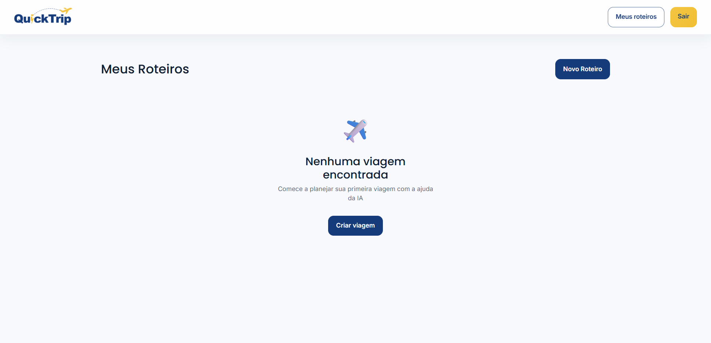
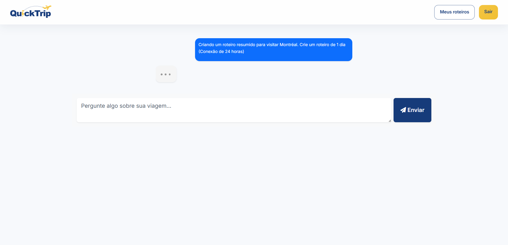
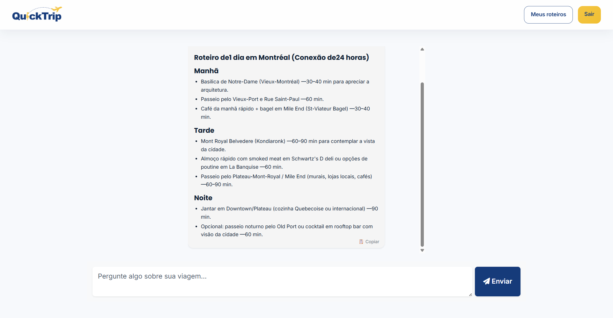

# ✈️ QuickTrip AI

Um assistente inteligente que cria roteiros de viagem personalizados em tempo real usando Inteligência Artificial.

👉 https://quicktrip-ai-rdf-0c5d170d4599.herokuapp.com/

---

## 📸 Preview






---

## 🚀 Funcionalidades

- Criação de roteiros de viagem com IA
- Chat em tempo real
- Atualização automática da interface (sem refresh)
- Feedback visual durante processamento ("Um momento...")
- Histórico de conversas
- Autenticação de usuários

---

## 🧰 Tecnologias utilizadas

- Ruby on Rails 8
- Hotwire (Turbo + Stimulus)
- ActionCable (WebSockets)
- SolidCable + SolidQueue
- PostgreSQL
- Heroku
- OpenAI API (via RubyLLM)

---

## 🧩 Arquitetura

O sistema utiliza:

- **Turbo Streams** para atualizar o chat em tempo real
- **ActionCable** para comunicação via WebSocket
- **Stimulus** para controle da interface e UX
- **Background Jobs** para processamento assíncrono das respostas da IA

---

## ⚡ Destaques técnicos

- Chat em tempo real construído com Rails puro (sem React)
- Streaming de resposta da IA token por token
- UX com loading imediato (thinking bubble)
- Separação clara entre frontend, backend e processamento assíncrono
- Deploy completo em produção com Heroku

---

## 🧠 Aprendizados

- Implementação de Turbo Streams em produção
- Debug de erros em ambiente Heroku
- Diferença entre jobs síncronos e assíncronos
- Controle de estado com Stimulus
- Integração de IA em aplicações Rails

---

## 🔧 Rodando localmente

```bash
git clone https://github.com/robertodefarias/Quick.git
cd Quick
bundle install
rails db:create db:migrate
rails s
